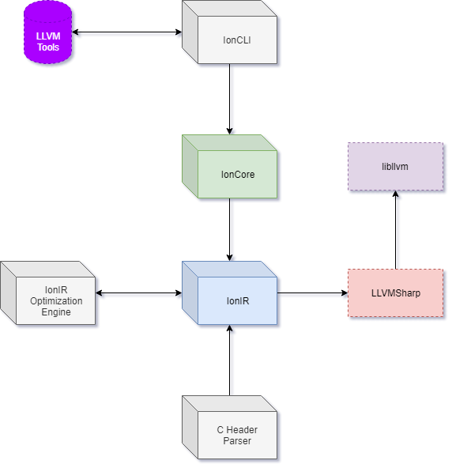

#### Table of contents

* [Introduction](#introduction)
* [Technologies](#technologies)
* [Workflow](#workflow)

#### Introduction

The Ion language project is a programming language currently undergoing active, early development. It was created mainly for research purposes, however it is fair to say that it has grown beyond that.

Ion is an umbrella project that borrows functionality from its various respositories to accomplish a fully functional, compiled programming language.

#### Technologies

The entire project has been implemented around Microsoft's C# language, using .NET Core.

#### Workflow

In the future, the Ion.IR repository will be the central point connecting all other repositories.

Below is a diagram of the future workflow implementation of the project.

